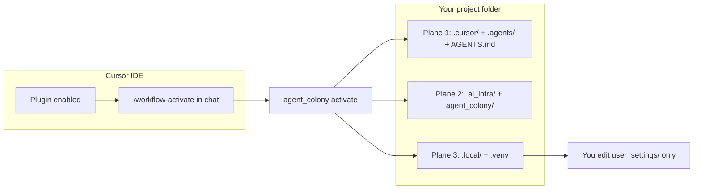

<!--
File: PLUGIN-USER-GUIDE.md
Path: .ai_infra/docs/operations/PLUGIN-USER-GUIDE.md
Role: Unified consumer-facing plugin manual — install, activate, use cases, file tree.
Used By:
 - README.md
 - AGENTS.md (stub)
 - consumer-quickstart.md
Depends On:
 - .ai_infra/manifest.yaml
 - .ai_infra/install-contract.json
 - .ai_infra/docs/decisions/ADR-001-distribution-activation.md
Notes:
 - Copied to consumer projects via manifest copy_ai_infra: docs/operations.
-->

# Agent Colony · Plugin User Guide

**Use ASD-STE100:** [asd-ste100-prose.md](asd-ste100-prose.md)


> **From the [kit README](https://github.com/SavinRazvan/agent-colony):** public landing lives on GitHub. Prefer the short path? [consumer-quickstart.md](consumer-quickstart.md). This guide is the full consumer manual.

Single entry point for **installing**, **activating**, and **using** the kit in your project. Deeper runbooks are linked as chapters — you do not need the kit maintainer repo open.

> **Before `/implementer`:** read [What you need — permissions & prerequisites](permissions-and-prerequisites.md) (Cursor, `gh` scopes, git, board SSOT, MCP).

---

## 1. Plugin vs activate vs three planes

Two things happen at different times:

| Stage | What changes | Where |
|-------|--------------|-------|
| **Install plugin** | Cursor loads agents, skills, rules from the plugin bundle | **IDE only** — nothing written to your project folder yet |
| **Activate** (`/workflow-activate`) | Copies infrastructure + trackers into your open workspace | **Your project on disk** |



| Plane | Paths | Cursor sees? | Purpose |
|-------|-------|--------------|---------|
| **Cursor contract** | `.cursor/`, `.agents/`, `AGENTS.md` | Yes | Agents, skills, rules, MCP config |
| **Infrastructure** | `.ai_infra/`, `agent_colony/` | No | Scripts, docs, templates, optional MCP server |
| **Runtime** | `.local/`, `.venv` | No | Trackers, deprecated HTML dashboards, user settings (gitignored) |

**Important:** Enabling the plugin does **not** replace activate. Open **your app folder** in Cursor, then run **`/workflow-activate`** once (safe to re-run — idempotent).

### Install plugin from GitHub (recommended until Marketplace listing)

In **Agent chat** (not the terminal):

```text
/add-plugin https://github.com/SavinRazvan/agent-colony
```

Cursor shows an **Add Plugin** preview — click the **Agent Colony** card to install:

<p align="center">
  <a href="https://raw.githubusercontent.com/SavinRazvan/agent-colony/main/assets/img/tutorials_img/01_tutorial_agent-colony.png" title="Open full resolution (1920×1080)">
    
  </a>
</p>
<p align="center"><sub><strong>Step 1</strong> — Preview card · <a href="https://raw.githubusercontent.com/SavinRazvan/agent-colony/main/assets/img/tutorials_img/01_tutorial_agent-colony.png">Full size</a> · more steps in <a href="consumer-quickstart.md#visual-walkthrough">consumer-quickstart</a></sub></p>

Optional — explicit branch:

```text
/add-plugin https://github.com/SavinRazvan/agent-colony/tree/main
```

This loads agents, skills, and rules into Cursor. Your project may only get `.cursor/settings.json` until you activate (§2).

**When listed:** **Cursor → Marketplace → Agent Colony → Install** — same two-step flow; you still run **`/workflow-activate`** afterward.

---

## 2. Quick start (5 steps)

**Need:** Cursor · Python 3.11+ · **your project** open (not the kit product repo `agent-colony`). Full checklist: [permissions-and-prerequisites.md](permissions-and-prerequisites.md).

| Step | Action |
|------|--------|
| 1. Plugin | Agent chat: `/add-plugin https://github.com/SavinRazvan/agent-colony` *(or Marketplace when listed)* |
| 2. Activate | Open **your app** → Agent chat → **`/workflow-activate`** → wait for **`VERIFY PASS`** |
| 3. Identity | Edit `github.collaboration.yaml` → `display_name` + `github_user` → `source .venv/bin/activate && python3 -m agent_colony contributors validate` |
| 3b. GitHub auth | `gh auth status` — refresh Project scopes only if missing (`gh auth refresh -h github.com -s read:project,project`) |
| 3c. Wire board | Agent chat **`/board`** + **Project URL + repo URL** → confirm proposed `project_ssot` ids → `project doctor` + `project status` |
| 4. Board shell | **Minimal 2-view** ([Playground #3](https://github.com/users/SavinRazvan/projects/3)) or **six-view default** → `/board` CONSENT + TURN → `board-bootstrap --check` exit **0** |
| 5. Build | **`/implementer`** · Entry = `python3 -m agent_colony project status` when board SSOT on |

**Step 2 — in Agent chat (not the terminal):**

```text
/workflow-activate
```

Shorter variant: [consumer-quickstart.md](consumer-quickstart.md).

### Consumer project_ssot onboarding checklist

Use this when your team opts into **GitHub Project as the only writable SSOT** (`project_ssot.enabled: true`, `sync_policy: board_only`). Complete in order after §2 activate.

#### Product promise

Install the **Agent Colony** plugin, open **your app repo** (not the kit product repo), and run **`/workflow-activate`**. Activate copies the **full kit infrastructure** — the same three planes kit maintainers use: Cursor contract (`.cursor/` agents, skills, rules; `.agents/skills/`; `AGENTS.md`), infrastructure (`.ai_infra/`, `agent_colony/` CLI), and runtime scaffold (`.local/` including `user_settings/` exemplars). You then wire **your** identity and **your** GitHub Project in `.local/user_settings/github.collaboration.yaml`.

**Ready for `/implementer` requires:** `contributors validate` + `project doctor` + **`project board-bootstrap --check` exit 0** (Tier-1 columns on Status board + Prioritized backlog + non-empty README). Accept either:

- **Minimal 2-view overlay** — Prioritized backlog + Status board only ([Playground #3 reference](https://github.com/users/SavinRazvan/projects/3)); or
- **Kit default** — six Playground views (no overlay).

Wire-only (`/board` YAML + fields) is **not** full shell readiness.

**Automation boundary:**

| Automated (CLI/API) | Human UI only (GitHub Project) |
|---------------------|--------------------------------|
| YAML ids, field definitions, README (`--apply-readme`) | Views (2 with minimal overlay, or 6 by default) |
| `contributors validate`, `project doctor`, `project status` | Column visibility on Status board + Prioritized backlog |
| `--ensure-fields` | Filters, layout, rename View 1 |

**Future:** `--apply-shell` when GitHub ships a public view mutation API — **not shipped today** (ADR-008).

After API wiring + shell green, agents use claim/handoff/Tier-1 the same way as kit-dev.

**You configure (consumer-specific):** `owner.display_name`, `owner.github_user`, `project_ssot` board identity + field/option ids, `default_repo`, and `gh` auth scopes (`read:project`, `project`, `repo`).

**Activate installs (same for every consumer):** agents, skills, rules, CLI, docs, templates, `.local/` scaffold — not your board ids.

**Board shape constraint:** Your Project must be **kit-shaped**. Arbitrary custom layouts are not auto-supported; activate does **not** invent field ids from a Project URL. **Estimate** is relative **points** (not hours) — see skill § Size↔Estimate. **Start date** is set on first In progress; **End date** is set on Done.

| Field | Required option keys |
|-------|---------------------|
| **Status** (single-select) | `backlog`, `ready`, `in_progress`, `in_review`, `done` |
| **Priority** (single-select) | `p0`, `p1`, `p2` |
| **Size** (single-select) | `xs`, `s`, `m`, `l`, `xl` |
| **Estimate** (number) | numeric field id (points) |
| **Start date** (date) | date field id |
| **End date** (date) | date field id |

Discover ids: manually via `gh project view <N> --owner <login>` / `gh project field-list <N> --owner <login>`, **or** after GitHub auth paste your **Project URL + app repo URL** in Agent chat and ask **`/board`** to propose YAML (you confirm before save). Optional field create: `python3 -m agent_colony project board-bootstrap --check --ensure-fields` (prints suggested YAML ids — human confirms before paste). After setup, run `python3 -m agent_colony project doctor` → `python3 -m agent_colony project board-bootstrap --check` → `python3 -m agent_colony project status` (views/README stay human-owned unless `--apply-readme`).

| Step | Action |
|------|--------|
| 1. Install / activate | Agent chat: `/add-plugin …` then **`/workflow-activate`** in **your app repo** — wait for **`VERIFY PASS`**. |
| 2. Collaboration YAML (identity) | Edit `.local/user_settings/github.collaboration.yaml`: set `owner.display_name`, `owner.github_user`, and (if using board SSOT) `project_ssot.enabled: true` + `sync_policy: board_only`. Board ids may stay empty until step 3b. |
| 3. GitHub auth | `gh auth status` first — refresh only if Project scopes missing. Canon: [permissions-and-prerequisites.md § GitHub CLI](permissions-and-prerequisites.md#2-github-cli-gh--main-github-authorization). |
| 3b. Wire board ids (agent-assisted) | Paste **Project URL** (`https://github.com/users/YOU/projects/N` or `…/orgs/ORG/projects/N`) **and** this **repo URL** in Agent chat → **`/board`** fills `name` / `number` / `owner` / `project_id` / `fields.*` / `default_repo` via `gh` (or you copy from `gh project view` / `field-list` yourself). Human confirms YAML before save. |
| 4. Doctor + board shell | `project doctor` → optional **minimal overlay** (`board-shell.schema.minimal.yaml` → `.local/user_settings/board-shell.schema.yaml`) for **2 views** matching [Playground #3](https://github.com/users/SavinRazvan/projects/3), **or** six-view default without overlay. → **`/board`** CONSENT GATE + TURN PROTOCOL → `board-bootstrap --check` until **exit 0** → `project status`. |
| 5. First card | `python3 -m agent_colony project create-from-template --template slice --title "…" --priority p1 --size s --estimate 1 --agent implementer` (assigns `owner.github_user` on Issues) → `claim --last --agent implementer` (sets Start date). Prefer `project guide`. |
| 6. Rate-limit buffer | Writes may **precheck** GraphQL quota (cached REST) or queue on throttle / Forbidden / 429. If a write returns **EXIT_QUEUED (6)**, do **not** retry-loop — continue local evidence; after quota recovers run `python3 -m agent_colony project outbox status` then `project outbox flush`. Configure `project_ssot.outbox` (`precheck_writes`, `dedupe_pending`, …) in collaboration YAML. Outbox is a local buffer, not a second Status SSOT. |
| 7. Incomplete cards | `project doctor` WARNs empty Status / CLOSED-not-Done counts. Repair: `project heal-cards --check` then `heal-cards --apply` (optional `--fill-tier1`). |

#### GitHub CLI auth (Projects)

> **Canonical checklist:** [permissions-and-prerequisites.md](permissions-and-prerequisites.md) — Profile A (no board) vs Profile B (board SSOT), token types, verify commands.

Board SSOT needs the **GitHub CLI** (`gh`) with **repository** access **and** **Projects** read/write. Without Project scopes, `project status` / `claim` / `outbox flush` fail with “missing required scopes”.

| Scope | Why |
|-------|-----|
| **`repo`** | Issues, PRs, default repo operations |
| **`read:project`** | Read Project / fields / items |
| **`project`** | Write Status, Notes, Tier-1 fields, claim/handoff |
| **`workflow`** (optional) | GitHub Actions / PR checks if you drive CI from `gh` |

**First login** (new machine):

```bash
gh auth login -h github.com
```

Choose HTTPS, authenticate via browser **or** device code, and allow access to the repos you use.

**Add Project permissions** to an existing login:

```bash
gh auth refresh -h github.com -s read:project,project
# Keep existing repo (and workflow) scopes — refresh adds Project access.
```

**If the terminal cannot open a browser** (WSL, headless, remote SSH — `xdg-open: no method available`):

1. Leave the terminal running after `gh auth login` / `gh auth refresh`.
2. Copy the **one-time code** `gh` prints (e.g. `ABCD-1234`).
3. Open **[https://github.com/login/device](https://github.com/login/device)** in any browser (Windows host browser is fine from WSL).
4. Paste the code → sign in → **approve** GitHub + **Project** permissions.
5. Return to the terminal — you should see `✓ Authentication complete.`

**Verify:**

```bash
gh auth status
# Logged in · Token scopes should include: repo, project
# (read:project may show separately or be covered when project is present)

python3 -m agent_colony project doctor
python3 -m agent_colony project status
```

If `gh` reports **missing required scopes `[read:project]` / `[project]`**, re-run `gh auth refresh -h github.com -s read:project,project` and complete the device link again.

Daily Entry after onboarding: `project status` (board first) — see [project-board-collaboration.md](project-board-collaboration.md).

---

## 3. What lands on disk after activate

From `manifest.yaml` (default profile **`with_mcp`**):

```text
your-project/
├── AGENTS.md                      # thin router (not overwritten on re-activate)
├── .cursor/
│   ├── agents/                    # 8 subagents (incl. board)
│   ├── skills/                    # protocols (activate, audit, integration, …)
│   ├── rules/                     # always-applied governance
│   └── mcp.json                   # with_mcp profile
├── .agents/skills/                # maintainer slash skills (/review-pr, …)
├── .ai_infra/
│   ├── manifest.yaml
│   ├── install-contract.json
│   ├── scripts/pr|architecture|integration|workflow|install/
│   ├── install/agent_colony/   # CLI package
│   ├── docs/operations|governance|roadmap|decisions|architecture/
│   ├── templates/local-workspace|user-settings|agent-integration/
│   ├── mcp_servers/agent_colony_mcp/  # with_mcp profile
│   └── workflows/
├── .local/                        # trackers, deprecated HTML dashboards (gitignored)
│   ├── index-and-planning/current/
│   ├── user_settings/             # YOU edit these
│   └── agents-control-center/
├── agent_colony/               # python3 -m agent_colony shim
├── .venv/                         # created on activate
└── (your app tests under tests/ — kit does not leave a smoke pytest by default)
```

**Not installed:** kit full `tests/`, `Makefile`, `docs/handoff/`, CI/release scripts, maintainer megadocs. Those exist only in the [kit repository](https://github.com/SavinRazvan/agent-colony).

**Re-activate is safe:** existing trackers, `user_settings/`, and `AGENTS.md` are not overwritten. Kit-managed **dashboard HTML**, JS/CSS, `module-audit.html`, and `pages.json` **are refreshed** on each activate.

### Upgrade / preserve (kit-managed vs private)

| Area | Light re-activate / heal | Full `update` or `--force` |
|------|--------------------------|----------------------------|
| `.local/user_settings/`, trackers | **Preserved** | **Preserved** |
| `AGENTS.md`, `mcp.user.json` | **Preserved** | **Preserved** |
| Dashboard HTML, `pages.json` | **Refreshed** | **Refreshed** |
| `.cursor/agents`, skills, rules | Skipped | **Overwritten** |
| `.ai_infra/`, `agent_colony/` | Skipped | **Overwritten** |

Run `python3 -m agent_colony update --check` before `--force`. Isolation contract: [multi-consumer-isolation.md](multi-consumer-isolation.md). Details: [upgrade-kit.md](upgrade-kit.md).

### Verification (multi-consumer isolation)

| Check | Command | Expected |
|-------|---------|----------|
| Runtime paths not tracked | `python3 -m agent_colony drift validate --profile consumer` | DRIFT-013 **PASS** (no `.local/`, `.venv/`, `.env`, `mcp.user.json` in git) |
| Kit agent edits before upgrade | `python3 -m agent_colony update --check` | Exit 0 when clean; exit 1 if kit agent files differ from payload |
| Extra custom agents | Same drift run | DRIFT-011b **PASS** with P2 advisory if `extra=` agents exist |
| CI gates (optional) | Copy `.ai_infra/templates/ci/consumer-gates.yml` → `.github/workflows/` | Drift + `prepare.py` green on PR |

---

## 4. Agent chat vs terminal

| Where | Use for |
|-------|---------|
| **Agent chat** (`/` menu) | Plugin install, activate, subagents, skills, PR slash workflow |
| **Terminal** | `python3 -m agent_colony …`, pytest, serving deprecated dashboards |

### Agent chat commands

| Goal | Type in chat |
|------|--------------|
| Install plugin | `/add-plugin https://github.com/SavinRazvan/agent-colony` |
| Activate (first install) | `/workflow-activate` |
| Upgrade kit (version-gated) | `/update-agent-colony` |
| Implement | `/implementer` |
| Tests | `/test-runner` |
| PR lifecycle | `/review-pr` → `/prepare-pr` → `/merge-pr` |
| Extend kit | `/integrator` |

### Terminal commands (project root)

```bash
cd ~/Projects/my-app
source .venv/bin/activate
```

| Command | Purpose |
|---------|---------|
| `python3 -m agent_colony activate --directory .` | First install / light heal when planes ready |
| `python3 -m agent_colony update --directory .` | Version-gated upgrade (heal or full refresh) |
| `python3 -m agent_colony contributors validate` | After editing collaboration YAML |
| `python3 -m agent_colony health` | Layout + version |
| `python3 -m agent_colony integrate validate` | Integration checks |
| `python3 -m agent_colony gates` | Full smoke gates |
| `python3 -m agent_colony drift validate --profile consumer` | Consumer drift (no agent required) — see [consumer-quickstart](consumer-quickstart.md#drift-on-consumer-apps) |
| `python3 -m agent_colony health` | Layout check (activate VERIFY; no kit smoke pytest by default) |

Full list: [consumer-quickstart.md](consumer-quickstart.md) § Terminal commands cheat sheet.

---

## 5. Control Center dashboards (deprecated)

> **Deprecated (2026-07-19).** Prefer the **GitHub Project board** (`python3 -m agent_colony project status`)
> and **Ctrl+Shift+P → Open Canvas**. HTML under `.local/agents-control-center/` is offline fallback only (ADR-008).

### Kit canvases (Open Canvas)

Versioned under repo `canvases/*.canvas.tsx` (git SSOT). **Rendering** uses Cursor’s managed path:

```text
~/.cursor/projects/<workspace-id>/canvases/*.canvas.tsx
```

Clicking a file in the repo explorer opens **source**, not the visualization. To view diagrams: **Ctrl+Shift+P → Open Canvas** (pick e.g. `agents-artifacts-board` or an `agent-*` canvas). See hub canvas `canvases/agents-artifacts-board.canvas.tsx` for the same note.

**Three-tier model (ADR-010):** repo `canvases/` (git SSOT) → sync → Cursor managed path (preview) → optional save → `.local/canvases/` (session evidence). Plan snapshots: `.local/plans/` (history only; live plan stays on board or `plan.md`). Agents execute plans from `.local/plans/`; humans bridge to IDE Build with `plan open --slug <slug>` (requires `--force` if a Cursor twin already exists).

```bash
python3 -m agent_colony canvas doctor
python3 -m agent_colony canvas list
python3 -m agent_colony canvas sync --name mcp-onboarding
python3 -m agent_colony canvas save --name <stem>
python3 -m agent_colony canvas sync --missing
python3 -m agent_colony plan snapshot --slug my-slice
python3 -m agent_colony plan list
python3 -m agent_colony plan open --slug my-slice
```

Skill: `.cursor/skills/canvas-artifacts/SKILL.md`

Legacy browser UI still ships on activate. **Do not open HTML via `file://`**. From project root:

```bash
cd ~/Projects/my-app
python3 -m http.server 8000
```

**Open in browser:** http://localhost:8000/.local/agents-control-center/dashboards/index.html

*(Port busy? Use `8001` — swap the port in every URL below.)*

| Page | URL |
|------|-----|
| Home | http://localhost:8000/.local/agents-control-center/dashboards/index.html |
| Control Center | http://localhost:8000/.local/agents-control-center/dashboards/implementation-control-center.html |
| Module audit | http://localhost:8000/.local/agents-control-center/audits/module-audit.html |

Refresh after kit update: **`/update-agent-colony`** or `python3 -m agent_colony update --directory .`

Details: [consumer-quickstart.md](consumer-quickstart.md) § Control Center dashboards.

---

## 6. Use-case matrix

| I want to… | Type in chat | Or run | Deep dive |
|------------|--------------|--------|-----------|
| **First-time setup** | `/workflow-activate` | `python3 -m agent_colony activate --directory .` | §2 above · [workflow-activate skill](../../.cursor/skills/workflow-activate/SKILL.md) |
| **First-run board shell** *(SSOT on)* | `/board` | paste Project+repo URLs → wire YAML → `project doctor` → `board-bootstrap --check` | [board-shell](../../.cursor/skills/board-shell/SKILL.md) · checklist §3b–4 |
| **Implement a feature slice** | `/implementer` | — | [implementer-loop](../../.cursor/skills/implementer-loop/SKILL.md) |
| **Run tests / coverage** | `/test-runner` | `pytest -q` | [workflow-complete.md](workflow-complete.md) §C |
| **Verify a claim** | `/verifier` | — | Check done claims vs evidence (no code fixes) |
| **Architecture audit** *(not day-0)* | `/auditor` | — (subagent only; no dedicated MCP tool) | [agent-workflow-procedures.md](agent-workflow-procedures.md) §1 — after board shell |
| **Operational drift** (goal/plan/doctrine/docs + DRIFT; board-first when SSOT on) | `/drift-guard` (optional) | `python3 -m agent_colony drift validate --profile consumer` on app projects | [ADR-007](../decisions/ADR-007-workflow-drift-guard.md) · [consumer-quickstart](consumer-quickstart.md#drift-on-consumer-apps) |
| **PR: review → prepare → merge** | `/review-pr` → `/prepare-pr` → `/merge-pr` | `prepare.py` `resolve_gates()` | [workflow-complete.md](workflow-complete.md) §A · [PR_WORKFLOW](../../.agents/skills/PR_WORKFLOW.md) |
| **Add agents / skills / MCP** | `/integrator` + `/integrator-protocol` | `integrate validate` | [integrator-protocol skill](../../.cursor/skills/integrator-protocol/SKILL.md) · [mas-infrastructure-integration.md](mas-infrastructure-integration.md) (ops filename kept) |
| **Connect external MCP** | `/mcp-connect` | edit `mcp.agents.yaml` | [connect-external-mcp.md](connect-external-mcp.md) |
| **Upgrade / version-gated refresh** | `/update-agent-colony` | `python3 -m agent_colony update --directory .` | [upgrade-kit.md](upgrade-kit.md) · [update-agent-colony skill](../../.cursor/skills/update-agent-colony/SKILL.md) |
| **Check install health** | — | `python3 -m agent_colony health` | [gate-matrix.md](gate-matrix.md) |
| **Dry-run install preview** | — | `python3 -m agent_colony install --target <dir> --dry-run` | [install-dry-run.md](install-dry-run.md) |

### Full `/` menu (8 agents + skills)

| Chat name | Disk path |
|-----------|-----------|
| `/workflow-activate` | `.cursor/skills/workflow-activate/` |
| `/update-agent-colony` | `.cursor/skills/update-agent-colony/` |
| `/implementer` | `.cursor/agents/implementer.md` |
| `/test-runner` | `.cursor/agents/test-runner.md` |
| `/verifier` | `.cursor/agents/verifier.md` |
| `/auditor` | `.cursor/agents/auditor.md` |
| `/drift-guard` | `.cursor/agents/drift-guard.md` |
| `/researcher` | `.cursor/agents/researcher.md` — **shipped/proven**; adaptive Brief; public/private GitHub (private needs `gh`/git auth); anti-loop ≤6 rounds; `research init\|fetch\|validate`; corpus opt-in after init |
| `/integrator` | `.cursor/agents/integrator.md` |
| `/board` | `.cursor/agents/board.md` + `board-ssot` + first-run `board-shell` |
| `/board-shell` | `.cursor/skills/board-shell/` — first-run coach (also via `/board`) |
| `/review-pr`, `/prepare-pr`, `/merge-pr` | `.agents/skills/` |
| `/integrator-protocol` | `.cursor/skills/integrator-protocol/` |
| `/mcp-connect` | `.cursor/skills/mcp-connect/` |
| `/auditor-protocol` | `.cursor/skills/auditor-protocol/` |
| `/drift-audit` | `.cursor/skills/drift-audit/` |

Cursor may also auto-delegate subagents when the task matches their `description` — explicit **`/name`** is the reliable manual path.

---

## 7. Daily workflow

Every session:

1. When `project_ssot.enabled`: `python3 -m agent_colony project status` (board first); else `.local/index-and-planning/current/session-pointer.md`
2. Board card Status/Notes — attribution `@user/agent · <ISO-8601-UTC> · …` (CLI stamps); local `history/continuity-index.md` rolls ≥3 days (local `plan.md` / `work-tracker.md` = offline fallback under `board_only`)
3. Rate-limit / precheck: EXIT_QUEUED (6) → do not retry-loop; `python3 -m agent_colony project outbox flush` after quota recovers (`project_ssot.outbox` in collaboration YAML — includes `precheck_writes` / `dedupe_pending`)
4. **`/implementer`** (or specialist agent from §6)
5. Optional: [Control Center dashboards (deprecated)](#5-control-center-dashboards-deprecated) — `http.server` + full URL in §5

Token contract: [token-efficiency.md](token-efficiency.md) · Layout: [local-workspace-layout.md](local-workspace-layout.md).

---

## 8. PR lifecycle (summary)

Pattern A — one script command per step; gate order lives only in `prepare.py`.

1. Feature branch (`feature/`, `fix/`, `chore/`)
2. Implement + test → **`/review-pr`**
3. **`/prepare-pr`** (runs `prepare.py` **`resolve_gates()`** — **2** checks on consumer, **5** on kit-dev)
4. **`/merge-pr`** (staged — stop here; branches may remain) · optional **`/full-pr-workflow`** → sync `main`, delete branch + `finalize.md`

Full checklist: [workflow-complete.md](workflow-complete.md).

---

## 9. Architecture audit (summary)

For architecture-impacting work before merge prep:

1. **`/auditor`** with skill **`/auditor-protocol`**
2. Outputs under `.local/workflow-artifacts/enterprise-architecture-audit/`
3. Focused PR pass may write `.local/workflow-artifacts/alignment/` instead

Procedure: [agent-workflow-procedures.md](agent-workflow-procedures.md).

---

## 10. Personalize settings

| File | Purpose |
|------|---------|
| `.local/user_settings/github.collaboration.yaml` | Commit trailers + PR artifact headers (**required**) |
| `.local/user_settings/mcp.agents.yaml` | Per-agent MCP attachments (optional) |

```bash
python3 -m agent_colony contributors validate   # must PASS before first PR
python3 -m agent_colony integrate validate      # P0 must be 0
python3 -m agent_colony health
```

Use project `.venv`: `source .venv/bin/activate` before CLI commands.

---

## 11. Verify and gates

| Command | When | Steps |
|---------|------|-------|
| `python3 -m agent_colony gates` | Post-change smoke | 4 on consumer (no doc-facts) |
| `python3 -m agent_colony health` | Anytime | Layout + version |
| `python3 -m agent_colony drift validate` | Slice closure (kit-dev) | Plan ↔ tracker coherence |
| `python3 -m agent_colony drift validate --profile consumer` | Consumer verify | DRIFT-005 + DRIFT-008 only; no agent required. **DRIFT-005 FAIL** on missing `IMPLEMENTATION-STATUS.md` = kit bug (false positive on older payloads) — see [consumer-quickstart](consumer-quickstart.md#drift-005-fail--kit-bug-not-your-app) |

Details: [gate-matrix.md](gate-matrix.md). **`make gates`** / **`make verify-all`** are **kit maintainer only**.

---

## 12. Troubleshooting

| Problem | Fix |
|---------|-----|
| `No module named 'agent_colony'` on first activate | **Expected** in empty app — run activate from kit **payload** entrypoint; see [consumer-quickstart § First activate troubleshooting](consumer-quickstart.md#first-activate-troubleshooting) |
| VERIFY FAIL / missing pytest after activate | `source .venv/bin/activate && pip install -r requirements-dev.txt && python3 -m agent_colony activate --directory .` |
| `bash: /add-plugin: No such file or directory` | Use **Agent chat**, not terminal — paste the GitHub URL after `/add-plugin` |
| Only `.cursor/settings.json` after plugin | Expected — run **`/workflow-activate`** for `.ai_infra/`, `.local/`, etc. |
| Subagents missing in `/` menu | Open **your activated project**, not kit repo; re-run `/workflow-activate` |
| `contributors validate` FAIL | Replace placeholders in `github.collaboration.yaml` |
| `pytest` not found | Re-run activate (creates `.venv`); use `source .venv/bin/activate` |
| Activate blocked in kit repo | Open your app folder — activate refuses self-install |
| Broken YAML in collaboration file | Keep `human_coauthors: []` or use a proper list |
| Control Center **Failed to fetch** | `python3 -m http.server 8000` from project root, then http://localhost:8000/.local/agents-control-center/dashboards/index.html — not `file://` |
| Stale dashboard / kit files after plugin update | Re-run `/update-agent-colony` or `python3 -m agent_colony update --directory .` — see [upgrade-kit.md § 0.6.7](upgrade-kit.md#changes-in-067) for auto-clean |
| `update --check` false FAIL (`__pycache__`, orphans) | Kit **0.6.7+** fixes this; until then `update --clean-only` or manual `find .ai_infra agent_colony -type d -name __pycache__ -prune -exec rm -rf {} +` |
| `DRIFT-005 FAIL` on consumer drift | **Kit bug (not your app)** — upgrade kit or ignore until skip-if-absent fix ships. Details: [consumer-quickstart](consumer-quickstart.md#drift-005-fail--kit-bug-not-your-app) |
| `mcp validate` → typer required | Use `python3 -m agent_colony mcp validate` — not bare `mcp validate` |

More: [consumer-quickstart.md](consumer-quickstart.md) § Troubleshooting.

---

## 13. Further reading (operations index)

| Topic | Doc |
|-------|-----|
| 5-step cheat sheet | [consumer-quickstart.md](consumer-quickstart.md) |
| Glossary / abbreviations | [abbreviations-notepad.md](abbreviations-notepad.md) |
| All runbooks | [operations README](README.md) |
| Three-plane architecture | [workflow-architecture.md](../architecture/workflow-architecture.md) |
| Board day-to-day | skill `board-ssot` · shell coach `board-shell` |
| MCP (DeepWiki, custom) | [connect-external-mcp.md](connect-external-mcp.md) |
| Research packs | skill `research-corpus` |
| Why plugin + payload | [ADR-001](../decisions/ADR-001-distribution-activation.md) |
| Upgrade / semver | [upgrade-kit.md](upgrade-kit.md) |
| Optional project metadata | [project-config.md](project-config.md) |

**Kit maintainers** (not copied to your project): [CONTRIBUTING.md](https://github.com/SavinRazvan/agent-colony/blob/main/CONTRIBUTING.md), `PLUGIN-ARCHITECTURE.md`, and `IMPLEMENTATION-STATUS.md` in the [GitHub kit repo](https://github.com/SavinRazvan/agent-colony/tree/main/.ai_infra/docs/handoff).
