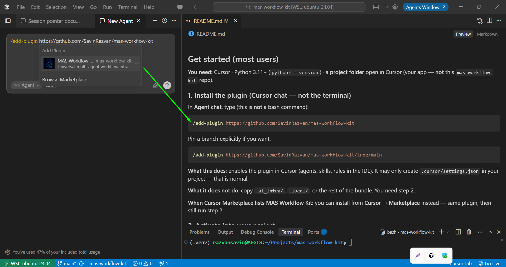

<p align="center">
  
</p>

# MAS Workflow Kit — Project SSOT

**Installable multi-agent workflow infrastructure for Cursor**, with a **GitHub Project** as the only writable SSOT for backlog, Status, and agent continuation when `project_ssot.enabled` and `sync_policy: board_only`. Local `.local/` holds PR gates, audits, and evidence — never a second Status writer.

| | |
|--|--|
| **Product repo** | [mas-workflow-kit-project-ssot](https://github.com/SavinRazvan/mas-workflow-kit-project-ssot) |
| **Version** | `0.4.0` · **Tests** · 1168 · **Agents** · 8 · **Rules** · **7 universal** |
| **Board (kit-dev)** | [AI Project Playground](https://github.com/users/SavinRazvan/projects/3) |
| **Standing** | **STANDALONE** — permanent product; lineage only from [mas-workflow-kit](https://github.com/SavinRazvan/mas-workflow-kit) (`v0.4.0` / `8a779fa`) |

---

## Who is this for?

| Audience | Start here |
|----------|------------|
| **Consumer** — install into *your* app repo | [§ Install in your project](#install-in-your-project-consumers) → [PLUGIN-USER-GUIDE](.ai_infra/docs/operations/PLUGIN-USER-GUIDE.md) |
| **Kit maintainer / agent** — develop *this* repo | [§ Work in this repository](#work-in-this-repository-kit-dev) → **[HANDOFF.md](HANDOFF.md)** (read first) → [AGENTS.md](AGENTS.md) |

---

## What you get

- **8 agents:** `implementer`, `test-runner`, `verifier`, `enterprise-auditor`, `researcher`, `integrator-mas-agent`, `workflow-drift-guard`, `project-board`
- **12 canonical skills** + maintainer PR slash skills (`/review-pr` → `/prepare-pr` → `/merge-pr`)
- **Board Pattern A CLI:** `python3 -m cursor_workflow project …` (claim, handoff, Tier-1 fields, outbox)
- **PR gates** via `prepare.py` · optional MCP (`workflow_mcp`) · research corpus under `_research_results/` (opt-in)

**North star:** Entry = read the Project; Exit = update Status + Notes. Details: [ADR-008](.ai_infra/docs/decisions/ADR-008-project-board-ssot.md) · [project-board-collaboration.md](.ai_infra/docs/operations/project-board-collaboration.md).

---

## Install in your project (consumers)

**Need:** [Cursor](https://cursor.com) · Python 3.11+ · **your app folder** open (not this kit repo).

### 1. Add the plugin (Agent chat — not the terminal)

```text
/add-plugin https://github.com/SavinRazvan/mas-workflow-kit-project-ssot
```

Click the **MAS Workflow Kit — Project SSOT** card:



*Marketplace listing is deferred; `/add-plugin` from GitHub is the supported path today.*

### 2. Activate into your workspace

Still in **your app** folder, Agent chat:

```text
/workflow-activate
```

Wait for **`VERIFY PASS`** and all three planes **ready**. Activate is idempotent (safe to re-run).

| Plane | Paths | Purpose |
|-------|-------|---------|
| Cursor contract | `.cursor/`, `.agents/`, `AGENTS.md` | Agents, skills, rules |
| Infrastructure | `.ai_infra/`, `cursor_workflow/` | CLI, scripts, docs, templates |
| Runtime | `.local/`, `.venv` | Trackers, **user settings** (gitignored) |

### 3. Configure your identity (and optional Project SSOT)

Edit **`.local/user_settings/github.collaboration.yaml`** (copied from exemplars on activate):

```yaml
owner:
  display_name: "Your Full Name"    # → Author: / Action-By:
  github_user: "@yourhandle"        # → GitHub-User:

# Optional — GitHub Project as only writable Status SSOT
project_ssot:
  enabled: true
  sync_policy: board_only           # board wins; local trackers = offline fallback
  # + name, number, owner, project_id, fields.* option ids
```

Set **identity** now (`display_name` / `github_user`). For Project SSOT, leave board ids incomplete if you want help — finish **GitHub auth** below, then paste your **Project URL + repo URL** in Agent chat (next block) so **`/project-board`** can wire the rest.

Validate identity:

```bash
source .venv/bin/activate
python3 -m cursor_workflow contributors validate
python3 -m cursor_workflow health
```

**With Project SSOT on** (kit-shaped board: Status · Priority · Size · Estimate **points** · Start date):

Agents and `cursor_workflow project …` call **`gh`**. You must authorize GitHub **and** grant **Projects** access (read + write).

```bash
# First time on this machine (interactive):
gh auth login -h github.com
# Or add/refresh Project scopes on an existing login:
gh auth refresh -h github.com -s read:project,project   # keep existing repo (+ workflow if you use Actions)

# If the terminal cannot open a browser (common on WSL):
# 1) Copy the one-time code gh prints
# 2) Open https://github.com/login/device in any browser
# 3) Paste the code → approve GitHub + Project permissions
# 4) Return to the terminal (✓ Authentication complete)

gh auth status   # expect scopes including: repo, project (read:project may appear too)
```

**Need help filling `project_ssot`?** After `gh auth status` looks good, paste both links in Agent chat and ask **`/project-board`**:

```text
Project: https://github.com/users/YOU/projects/N
# or org: https://github.com/orgs/ORG/projects/N
Repo:    https://github.com/YOU/your-app
```

The agent uses `gh project view` / `field-list` (and optional `board-bootstrap --check --ensure-fields`) to propose `owner` / `number` / `project_id` / field ids and `default_repo` — you confirm before saving. You still own view/column setup in the GitHub UI (§4).

Then:

```bash
python3 -m cursor_workflow project doctor
python3 -m cursor_workflow project board-bootstrap --check
python3 -m cursor_workflow project status
```

**Expected on a brand-new Project:** `doctor: ok` and `status` enabled, but `board-bootstrap --check` **FAIL** (still on GitHub’s blank `View 1` — missing Status board / Prioritized backlog / …). That is normal. **Do not** jump to `/implementer` yet — continue with **step 4** below.

There is **no** terminal command that **creates** Project **views** today (`--check` only **reads** views for validation). Step 4 = Agent coach (**CONSENT GATE** + TURN PROTOCOL) + **you** in the browser (plus optional terminal for fields/README only). **`--apply-shell` is not shipped.**

Full checklist: [PLUGIN-USER-GUIDE § Consumer project_ssot onboarding](.ai_infra/docs/operations/PLUGIN-USER-GUIDE.md#consumer-project_ssot-onboarding-checklist).

---

### 4. Prepare the board with `/project-board` (required when SSOT is on)

> **This is the step after §3.** Skip it and `/implementer` will fight a blank `View 1` board.

**You are here** when `project doctor` is ok but `board-bootstrap --check` prints `FAIL — missing minimum view '…'` and/or `WARN — rename default view 'View 1'`.

#### What runs where (do not expect a magic CLI for views)

| Action | Where | Command / prompt |
|--------|--------|------------------|
| Check shell | Terminal | `python3 -m cursor_workflow project board-bootstrap --check` |
| Create missing **fields** (Priority/Size/…) | Terminal (optional) | `… board-bootstrap --check --ensure-fields` then confirm YAML |
| Push Project **README** | Terminal (optional) | `… board-bootstrap --check --apply-readme` |
| Create/rename **views** + show **columns** | **Browser** + Agent coach | **`/project-board`** TURN PROTOCOL (below) — **no CLI** |
| Day-to-day cards | Later (§5) | `/implementer` only after `--check` is green |

#### A. Tell the agent (Agent chat in **your app** repo — copy/paste)

The agent **must** first ask for a **board description** and **explicit yes** to create the default shell (CONSENT GATE). Then it coaches **one view per turn** (TURN PROTOCOL) — not dump “follow views-setup” and stop.

```text
/project-board

board-bootstrap --check FAIL CODE=5 — missing all six Playground views (still on View 1).
Run board-shell-onboard: CONSENT GATE first (ask my board description + "may I proceed?"),
then TURN PROTOCOL only:
- one view (or column fix) per message
- wait for my reply "done"
- re-run: python3 -m cursor_workflow project board-bootstrap --check after each turn
Do NOT skip consent. Do NOT say only "follow views-setup.md". Do NOT start /implementer until --check is green.
Project: https://github.com/users/YOU/projects/N
Repo: https://github.com/YOU/your-app
```

Skill: [board-shell-onboard](.cursor/skills/board-shell-onboard/SKILL.md) · clicks: [views-setup.md](.ai_infra/templates/project-board/views-setup.md) § Fast path · checklist: [views-checklist.md](.ai_infra/templates/project-board/views-checklist.md).

#### B. You click in GitHub (while the agent coaches)

Open the Project (`project status` → `url`). Build the **default** shell:

| View | Layout (short) |
|------|----------------|
| **Status board** | Board · group by Status |
| **Prioritized backlog** | Table · show Priority, Size, Estimate, Start date |
| **Roadmap** | Roadmap |
| **Bugs** | Table · filter title contains `[BUG]` |
| **In review** | Table · Status = In review |
| **My items** | Table · Assignees = `@me` |

On **Status board** and **Prioritized backlog**, show Tier-1 columns: **Priority**, **Size**, **Estimate**, **Start date**.

#### C. Terminal helpers (after views exist, or for README anytime)

```bash
# optional: create missing field *definitions* (not views)
python3 -m cursor_workflow project board-bootstrap --check --ensure-fields

# optional: push kit Project README
python3 -m cursor_workflow project board-bootstrap --check --apply-readme

# required: prove the shell (repeat until exit 0, no FAIL, no Priority/Start date WARNs)
python3 -m cursor_workflow project board-bootstrap --check
```

**Misread trap:** `CODE=5` + `missing minimum view 'Status board'` = **views in the browser**, not README. `--apply-readme` alone will **not** clear those FAILs.

**Do not** start with `/enterprise-auditor`. When bootstrap is green → **step 5** `/implementer`.

---

### 5. Start building

| Goal | In Agent chat |
|------|----------------|
| Implement a slice | `/implementer` |
| Tests / coverage | `/test-runner` |
| Verify a claim | `/verifier` |
| PR lifecycle | `/review-pr` → `/prepare-pr` → `/merge-pr` |
| Research a repo | `/researcher` + a GitHub URL |
| Extend agents/skills/MCP | `/integrator-mas-agent` |
| Architecture audit *(later)* | `/enterprise-auditor` — not day-0 onboarding |

**Every session Entry:** if `project_ssot.enabled` → `python3 -m cursor_workflow project status`; else → `.local/index-and-planning/current/session-pointer.md`.

Shorter path: [consumer-quickstart.md](.ai_infra/docs/operations/consumer-quickstart.md).

### Optional — Update the kit / plugin later

Docs and agents in **your app** come from the plugin payload + `/workflow-activate`. Re-reading the kit README on GitHub does **not** change Smart-Notes until you refresh.

1. **Ship on the kit repo first** (maintainer): merge the change to `main` (PR workflow).
2. **In your app** (e.g. Smart-Notes), Agent chat — refresh the plugin from GitHub:

```text
/add-plugin https://github.com/SavinRazvan/mas-workflow-kit-project-ssot
```

3. Re-activate (safe / idempotent — keeps `.local/user_settings/` and existing `AGENTS.md`):

```text
/workflow-activate
```

Or terminal:

```bash
source .venv/bin/activate
python3 -m cursor_workflow activate --directory .
```

4. Sanity check:

```bash
python3 -m cursor_workflow health
python3 -m cursor_workflow project board-bootstrap --check   # still FAIL until you finish step 4 views in GitHub UI
```

**Force** full overwrite of agents/skills/scripts (review diffs): `python3 -m cursor_workflow activate --directory . --force`  
Details: [upgrade-kit.md](.ai_infra/docs/operations/upgrade-kit.md).

**Board views are not fixed by a plugin update.** `board-bootstrap --check` FAIL on missing views only clears after you complete **step 4** (`/project-board` + human UI). Updating the plugin only refreshes docs/coaching text.

---

## Work in this repository (kit-dev)

```bash
gh repo clone SavinRazvan/mas-workflow-kit-project-ssot
cd mas-workflow-kit-project-ssot
python3 -m venv .venv && source .venv/bin/activate
pip install -e ".[dev,mcp]"
```

1. Open the folder in Cursor.
2. Read **[HANDOFF.md](HANDOFF.md)** first, then [AGENTS.md](AGENTS.md).
3. Confirm collaboration YAML under `.local/user_settings/` (owner + `project_ssot`).
4. Start:

```bash
python3 -m cursor_workflow project status
python3 -m cursor_workflow project list --status ready
# create / claim — see: python3 -m cursor_workflow project guide
```

Maintainer gates: `make gates` · `make drift-validate` · `make doc-validate` · shipped matrix: [IMPLEMENTATION-STATUS](.ai_infra/docs/handoff/IMPLEMENTATION-STATUS.md). Kit canvases: **14** files under `canvases/` (**11** agent/roster hubs + 3 concept hubs — see IMPLEMENTATION-STATUS § Kit canvases).

---

## Documentation map

| Doc | Audience |
|-----|----------|
| [HANDOFF.md](HANDOFF.md) | Kit-dev agents & maintainers (identity, north star) |
| [AGENTS.md](AGENTS.md) | Day-to-day agent execution |
| [PLUGIN-USER-GUIDE](.ai_infra/docs/operations/PLUGIN-USER-GUIDE.md) | Consumers — install, activate, board onboarding |
| [consumer-quickstart](.ai_infra/docs/operations/consumer-quickstart.md) | 5-minute consumer path |
| [Docs index](.ai_infra/docs/README.md) | Full `.ai_infra/docs/` navigation |
| [repository-map](.ai_infra/docs/handoff/repository-map.md) | Kit vs payload vs consumer install |
| [assets/](assets/README.md) | Logo + install screenshot |

---

## License

Apache 2.0 — [LICENSE](LICENSE) · [NOTICE](NOTICE)
