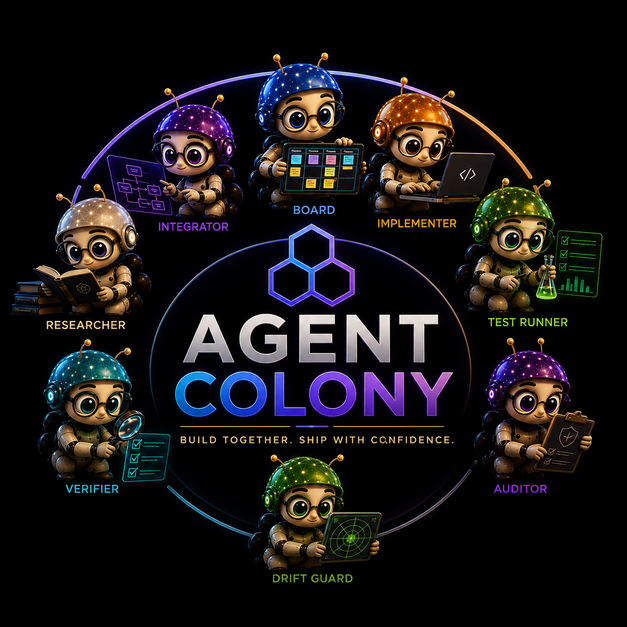

<p align="center">
  
</p>

# Agent Colony

**Stop losing Status in chat.** Agent Colony installs a full multi-agent kit into *your* [Cursor](https://cursor.com) app repo — **8** agents, PR gates, and optional GitHub Project coordination so backlog and Status live on the board when you enable it.

<p align="center">
  <video src="https://github.com/user-attachments/assets/f9015ab5-28bf-47f7-a065-2127c098b80e" width="720" controls></video>
</p>

<p align="center"><em>Agent Colony at work</em></p>

| | |
|--|--|
| **Version** | [`0.6.1`](https://github.com/SavinRazvan/agent-colony/releases) · **Tests** · 1484 · **Agents** · 8 · **Skills** · 14 · **Rules** · **7 universal** · **License** · [Apache-2.0](LICENSE) |
| **Reference board** | [AI Project Playground](https://github.com/users/SavinRazvan/projects/3) |

---

## The problem

Agent chats lose Status. Trackers and docs drift. Teams re-explain the same slice every session.

## The solution

**Agent Colony** installs a full Cursor kit into *your* app repo (not this kit repo). When Project SSOT is on, the **GitHub Project** is the only writable place for backlog and Status — agents **enter** by reading the board and **exit** by updating Status and Notes. Local `.local/` holds gates, audits, and evidence — not a second Status writer.

**Proof:** 1484 tests · 8 agents · reference layout on [Playground #3](https://github.com/users/SavinRazvan/projects/3).

---

## What this is / is not

| | |
|--|--|
| **Is** | Installable Cursor workflow kit: 8 agents, PR gates, local evidence; optional GitHub Project coordination, MCP, and research packs |
| **Is not** | A new LLM runtime, chatbot framework, or hosted SaaS |

---

## Why teams use it

- **Optional board SSOT** — when enabled, backlog and Status stay on the GitHub Project; chat is execution, not the source of truth
- **Eight specialized agents** — implement, test, verify, audit, research, integrate, drift-check, board coach
- **PR gates** — prepare/merge evidence before ship
- **MCP-ready** — kit MCP server; DeepWiki seeded on consumer activate by default
- **Local evidence** — `.local/` for audits, coverage, and workflow artifacts (gitignored)

---

## Agents

| Agent | Job |
|-------|-----|
| `implementer` | Disciplined implementation slices with trackers and Pattern A gates |
| `test-runner` | Module-focused tests, regressions, and coverage |
| `verifier` | Check “done” claims against fresh evidence (try to disprove; no code fixes) |
| `auditor` | Deep/periodic evidence architecture audit (CHK-*; not plan pulse) |
| `researcher` | Brief-driven multi-round research packs; no product code |
| `integrator` | Integrate agents, skills, MCP expansions (procedural, Pattern A) |
| `drift-guard` | Continuous goal/plan/doctrine coherence + DRIFT scripts (handoff remediations only) |
| `board` | Wire Project SSOT, triage cards, and coach first-run board shell |

When `project_ssot.enabled`, agents **enter** by reading the board and **exit** by updating Status and Notes — see [PLUGIN-USER-GUIDE](.ai_infra/docs/operations/PLUGIN-USER-GUIDE.md).

Slash skills cover activate, update, board protocols, PR lifecycle (`/review-pr` → `/prepare-pr` → `/merge-pr`), and more — see the [Plugin User Guide](.ai_infra/docs/operations/PLUGIN-USER-GUIDE.md).

---

## Requirements

[Cursor](https://cursor.com) · Python 3.11+ · open **your app folder** (not this kit repo) · for board SSOT: [GitHub CLI](https://cli.github.com/) with Project access

---

## Install (consumers)

### Try in ~2 minutes

In **Agent chat** (not the terminal):

```text
/add-plugin https://github.com/SavinRazvan/agent-colony
```

Click the **Agent Colony** card:


Then in **your app** folder:

```text
/workflow-activate
```

Wait for **`VERIFY PASS`**. Sanity check:

```bash
source .venv/bin/activate
python3 -m agent_colony health
```

### Full board experience (when Project SSOT is on)

Same Try steps, then finish this ladder (detail: [consumer-quickstart](.ai_infra/docs/operations/consumer-quickstart.md) · [PLUGIN-USER-GUIDE](.ai_infra/docs/operations/PLUGIN-USER-GUIDE.md)):

1. **Identity** — edit `.local/user_settings/github.collaboration.yaml` (`display_name`, `github_user`; enable `project_ssot`) → `python3 -m agent_colony contributors validate`
2. **Wire board** — Agent chat `/board` with your **Project URL** and **repo URL** → confirm proposed ids → `python3 -m agent_colony project doctor` and `project status`
3. **Board shell** — create the required views/columns in the GitHub UI (coach: `/board`) until:

```bash
python3 -m agent_colony project board-bootstrap --check
```

exits **0**. Wire-only is not enough.

4. **Build** — `/implementer` (not day-0 `/auditor`)

**Ready when:** `health` passes after activate; **and** (if board SSOT is on) `board-bootstrap --check` exits 0 before day-to-day agents.

---

## What happens next

| Topic | Go to |
|-------|--------|
| Identity / user settings | [PLUGIN-USER-GUIDE § Personalize](.ai_infra/docs/operations/PLUGIN-USER-GUIDE.md#10-personalize-settings) |
| Board wire + shell | [consumer-quickstart](.ai_infra/docs/operations/consumer-quickstart.md) · [`board-shell`](.cursor/skills/board-shell/SKILL.md) |
| MCP (DeepWiki, custom servers) | [connect-external-mcp.md](.ai_infra/docs/operations/connect-external-mcp.md) |
| Research packs | [`research-corpus`](.cursor/skills/research-corpus/SKILL.md) · Guide [use-case matrix](.ai_infra/docs/operations/PLUGIN-USER-GUIDE.md#6-use-case-matrix) |
| Upgrade an existing install | `/update-agent-colony` · [upgrade-kit.md](.ai_infra/docs/operations/upgrade-kit.md) |
| Three planes (architecture) | [workflow-architecture.md](.ai_infra/docs/architecture/workflow-architecture.md) |

---

## Kit maintainers

Developing **this** repository? See **[CONTRIBUTING.md](CONTRIBUTING.md)** (clone, venv, gates), then **[AGENTS.md](AGENTS.md)** for agent doctrine.

---

## Documentation map

| Doc | Audience |
|-----|----------|
| [consumer-quickstart](.ai_infra/docs/operations/consumer-quickstart.md) | Consumers — 5-step install |
| [PLUGIN-USER-GUIDE](.ai_infra/docs/operations/PLUGIN-USER-GUIDE.md) | Consumers — full manual |
| [Abbreviations notepad](.ai_infra/docs/operations/abbreviations-notepad.md) | Consumers + kit-dev — glossary (SSOT, DRIFT, Pattern A, agents) |
| [CONTRIBUTING.md](CONTRIBUTING.md) | Kit-dev setup |
| [AGENTS.md](AGENTS.md) | Kit-dev agent doctrine |
| [Docs index](.ai_infra/docs/README.md) | Full `.ai_infra/docs/` navigation |
| [repository-map](.ai_infra/docs/handoff/repository-map.md) | Kit vs payload vs consumer install |
| [assets/](assets/README.md) | Logo, video, install screenshot |

---

## License

Apache 2.0 — [LICENSE](LICENSE) · [NOTICE](NOTICE)
