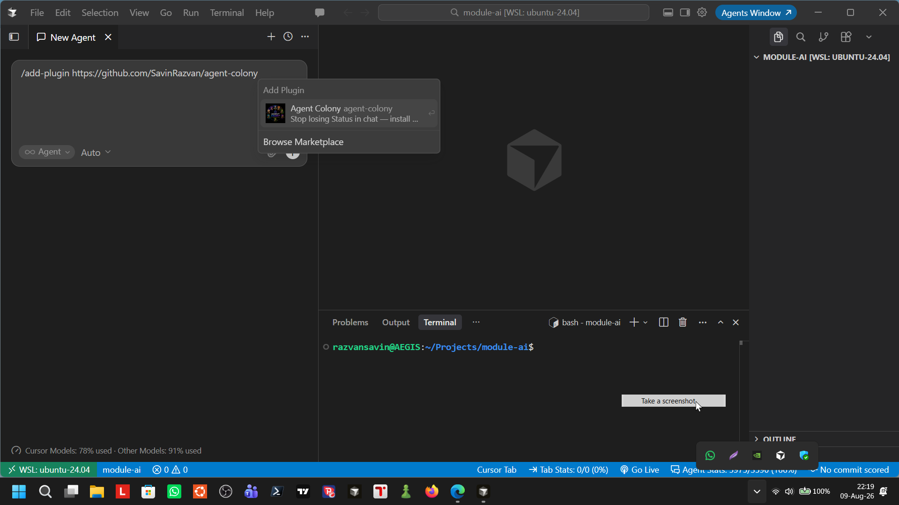
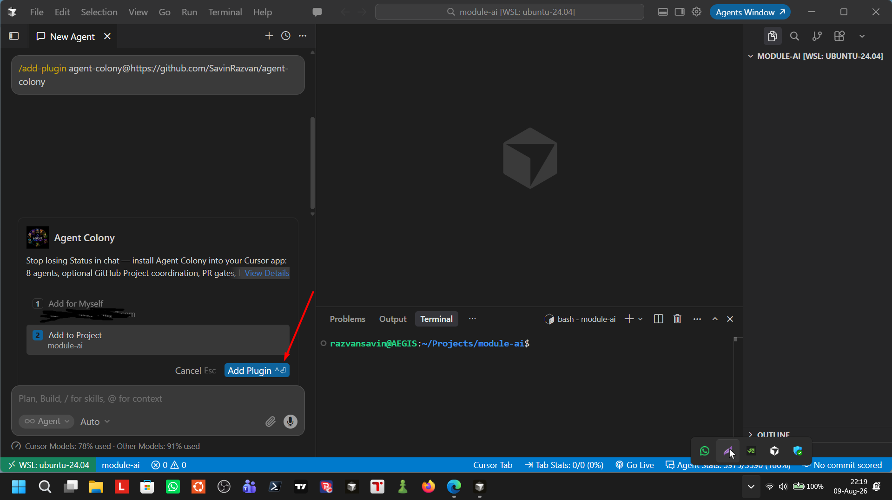
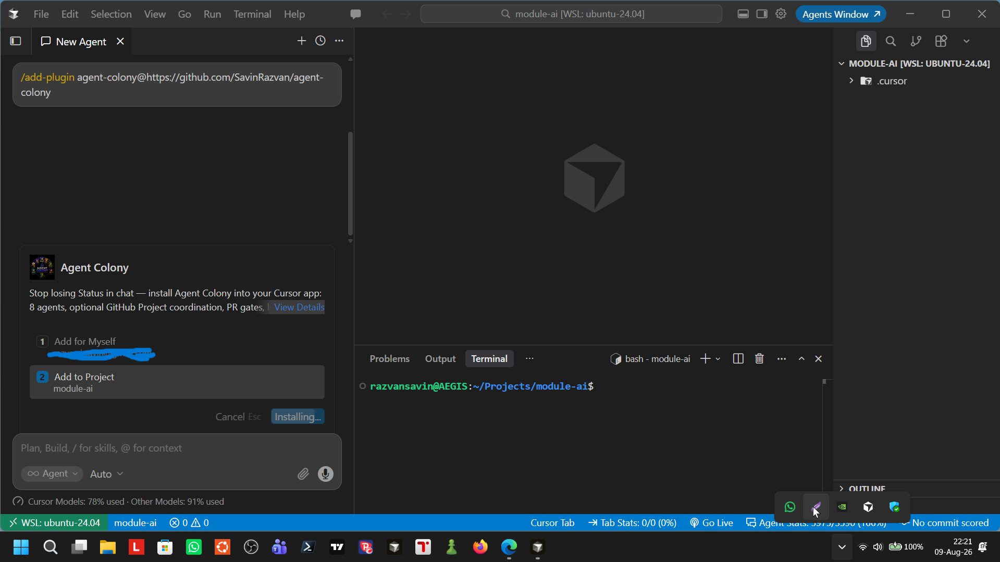
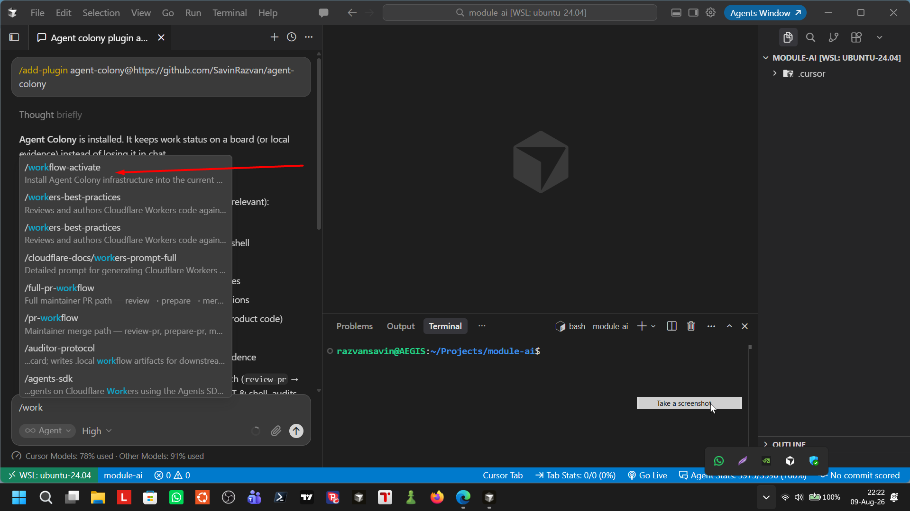
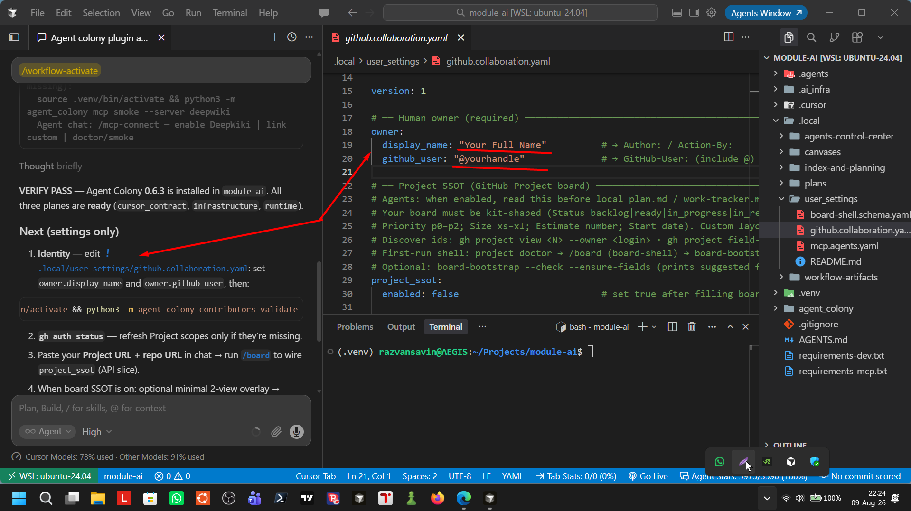
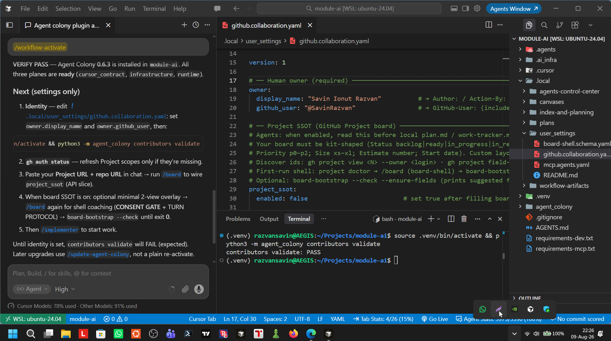
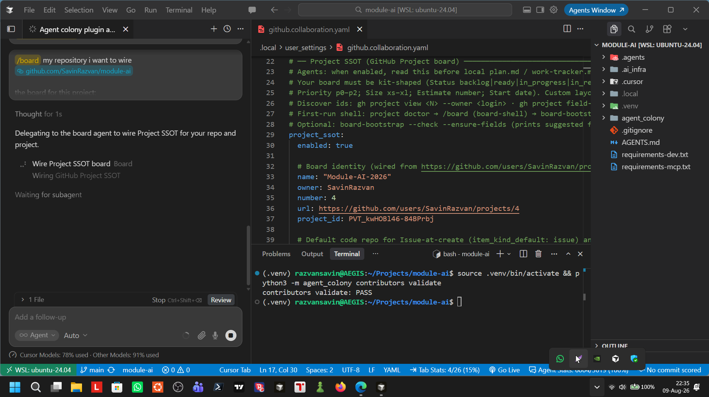
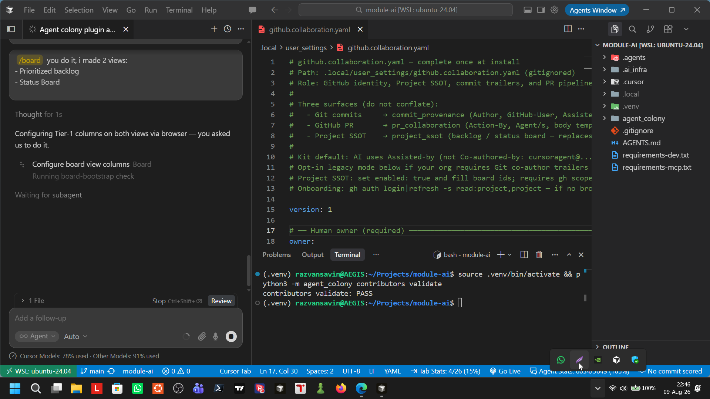
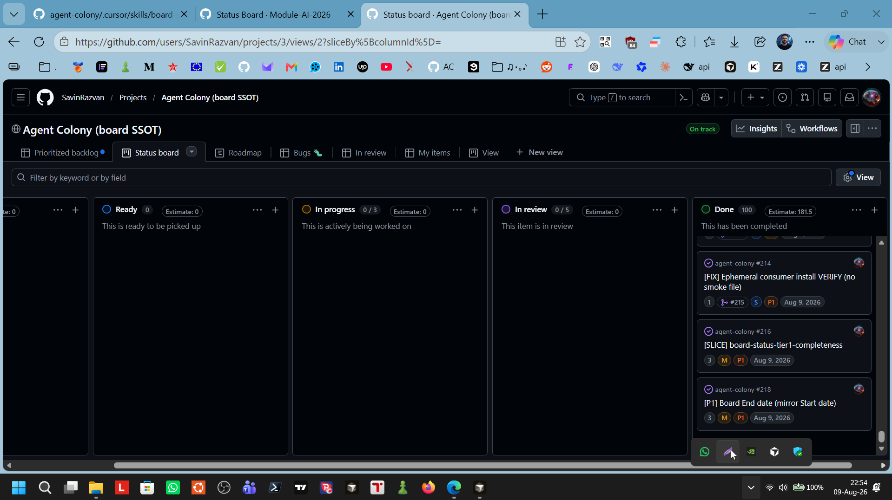

<p align="center">
  
</p>

# Agent Colony

**A coordination and accountability system for multi-agent work in [Cursor](https://cursor.com)** — not a prompt pack.

When `project_ssot` is on, **GitHub Projects** is the writable state engine. Agents follow **Entry → work → evidence → Exit**. Role cards, skills, and **always-on rules** set discipline. CLI, MCP, and PR scripts **enforce** it: Status→Done can fail closed; prepare/merge refuse soft skips; audit artifacts must match Schema-1.

<p align="center">
  <video src="https://github.com/user-attachments/assets/f9015ab5-28bf-47f7-a065-2127c098b80e" width="720" controls></video>
</p>

<p align="center"><em>Agent Colony at work — board Status, attributed Notes, evidence under <code>.local/</code></em></p>

| | |
|--|--|
| **Version** | [`0.8.0`](https://github.com/SavinRazvan/agent-colony/releases/tag/v0.8.0) · **Tests** · 1671 · **Agents** · 8 (6 on `consumer_lite`) · **Skills** · 16 (6 on lite) · **Rules** · 7 (4 always-on + 3 requestable) · **MCP** · 29 tools + 7 resources · **License** · [Apache-2.0](LICENSE) |
| **Reference board** | [AI Project Playground](https://github.com/users/SavinRazvan/projects/3) |

---

## The problem

Agent chats lose Status. Local trackers drift from “what we said we shipped.” Peers rubber-stamp “done” without fresh proof. Context dies when the thread ends. Soft procedures do not stop a merge or a Done click.

## The solution

**Agent Colony** turns Cursor multi-agent coding into a **disciplined pipeline** with three layers that work together:

| Layer | What it does |
|-------|----------------|
| **Coordination** | Board SSOT (when enabled): one backlog, one Status, Tier-1 fields, Pattern A CLI (`entry` / `claim` / `handoff` / `mention-pr`). Chat executes; the board remembers. |
| **Accountability** | Attributed Notes (`@user/agent · UTC · …`). Evidence in gitignored `.local/` (tests, audits, PR prep, drift). Evidence-first: facts → proof → action — or label **Partial**. |
| **Enforcement** | Machine checks — not vibes. Verifier-before-Done on shippable cards. `prepare.py` → `resolve_gates()`. Arch-impacting merge needs Schema-1 alignment. EXIT_QUEUED (6) + outbox under GraphQL throttle (no retry hammer). |

### Full kit vs `consumer_lite`

Same plugin release (**0.8.0**). Profiles change Cursor footprint, not a second product. Spec: [consumer-lite-profile.md](.ai_infra/docs/operations/consumer-lite-profile.md).

| Surface | Both profiles | Full only (`with_mcp` default) | Lite only notes |
|---------|---------------|--------------------------------|-----------------|
| **Agents** | `board`, `implementer`, `test-runner`, `verifier`, `drift-guard`, `integrator` | + `auditor`, `debugger`, `researcher` | 6 total |
| **Skills** | `board-ssot`, `implementer-loop`, `evidence-first`, `test-coverage`, `workflow-activate`, `mcp-connect` | + `board-shell`, `integrator-protocol`, `auditor-protocol`, `drift-audit`, `audit-orchestration`, `audit-module-map`, `agent-surface-parity`, `research-corpus`, `canvas-artifacts`, `update-agent-colony`, eleven `debug-*` protocols (**27** total) | **6** total; first-run coach inline in `board.md` |
| **Rules** | 7 (4 always-on + 3 requestable) | same | same |
| **MCP** | 29 tools + 7 resources | same | lite extends `with_mcp` |
| **PR slash skills** | `review-pr`, `prepare-pr`, `merge-pr`, `pr-workflow`, `full-pr-workflow` | + maintainer extras pruned on lite | kept on lite (0.7.1+) |
| **Enforcement** | Board CLI, verifier-before-Done, prepare/merge gates, EXIT_QUEUED outbox | Schema-1 audits via `/auditor` | drift validate is profile-aware |

Proof: **1653** tests · live reference on [Playground #3](https://github.com/users/SavinRazvan/projects/3).

---

## How we enforce (real gates)

These are **machine exits and merge refusals**, not prompt suggestions.

| Gate | What fails closed |
|------|-------------------|
| **Verifier-before-Done** | `item_is_shippable` (PR citation / `[AUDIT]` / P0\|P1): Status→Done returns **EXIT_VALIDATION (5)** unless `--agent verifier`, prior Notes `next=…/verifier`, or `--allow-skip-verifier` + rationale |
| **PR prepare** | `prepare.py` → `resolve_gates()` — **2** universal; **6** on kit-dev (tests + drift + doc facts + `sync_plugin_bundle --check` + audit artifacts). Architecture pipelines refuse `--skip-gates` |
| **PR merge (arch-impacting)** | Schema-1 alignment pair required; open P0/P1 in that pair fail merge |
| **Board validate-item** | Audit cards: Notes must cite `.local/workflow-artifacts/`; bad Schema-1 path → **EXIT_VALIDATION (5)** |
| **Pattern A + rate-limit** | Prefer `entry` / `claim` / `handoff` / `mention-pr`. Low GraphQL / throttle → **EXIT_QUEUED (6)** → cooldown + local outbox → `api-ready` then flush. Outbox is **not** SSOT; do not retry-loop |
| **Drift / audit independence** | DRIFT checks + auditor `Commissioned-By` ≠ `Audited-By` (ADR-013) |

Canon: [gate-matrix.md](.ai_infra/docs/operations/gate-matrix.md) · [project-board-collaboration.md](.ai_infra/docs/operations/project-board-collaboration.md) · [evidence-first.md](.ai_infra/docs/operations/evidence-first.md) · [ADR-013](.ai_infra/docs/decisions/ADR-013-audit-accountability.md) (kit-process accountability; insight transfer from Birhane et al., [arXiv:2401.14462](https://arxiv.org/abs/2401.14462) — not product-ML / societal audits).

---

## What this is / is not

| | |
|--|--|
| **Is** | Installable Cursor workflow kit: agents + skills + rules + CLI/MCP that **coordinate** work on a GitHub Project and **enforce** handoffs, evidence, and ship gates |
| **Is not** | A new LLM runtime, chatbot framework, hosted SaaS, or “agents that only suggest best practices” |

**Shipped infrastructure (three planes):** Cursor contract (`.cursor/` agents, skills, rules; `.agents/skills/`; `AGENTS.md`) · kit CLI + docs (`.ai_infra/`, `agent_colony/`) · runtime evidence (`.local/`). Same planes on consumer activate — see [workflow-architecture.md](.ai_infra/docs/architecture/workflow-architecture.md).

---

## Why teams use it

- **Discipline by default** — 4 always-on rules (implementation lifecycle, PR-first, local artifact protection, board SSOT precedence) plus requestable commit/header/audit rules
- **Coordination without dual-write** — when `board_only`, Status lives on the Project; `.local/` holds evidence and outbox only
- **Accountability you can audit** — Entry/Exit, Tier-1 fields, verifier falsification, auditor independence
- **Ship path that refuses theater** — prepare/merge + verifier-before-Done + Schema-1 on architecture changes
- **MCP Pattern A** — 29 tools as thin wrappers over the same CLI (same exits, same outbox behavior)
- **Local evidence** — gitignored `.local/` for audits, coverage, PR artifacts, cooldown/outbox

---

## Agents (roles with teeth)

| Agent | Profile | Job | Hard boundary |
|-------|---------|-----|---------------|
| `implementer` | both | Slices with trackers / board claim + Pattern A | Does not close shippable work as Done without verifier path |
| `test-runner` | both | Module tests, regressions, coverage evidence | Produces proof; does not redefine product scope |
| `verifier` | both | Falsification-first: try to **disprove** “done” | **No code fixes** — fresh evidence only |
| `integrator` | both | Wire agents, skills, MCP expansions | Procedural + Pattern A; no silent doctrine drift |
| `drift-guard` | both | Goal/plan/doctrine coherence + DRIFT scripts | Handoff remediations only — no silent tracker dual-write |
| `board` | both | Wire SSOT, triage, first-run board shell | Coaches bootstrap; humans own views/Insights |
| `auditor` | full | Deep CHK-* architecture audit → Schema-1 artifacts | Independent of commissioner (`Commissioned-By` ≠ `Audited-By`) |
| `researcher` | full | Multi-round research packs under `_research_results/` | **No product code** |
| `debugger` | full | Forensic campaigns under `.local/workflow-artifacts/debug/`; `python3 -m agent_colony debug` | **No behavioral product fixes** — routes DBG/TR to peers |

Slash skills: activate, board protocols, PR lifecycle (`/review-pr` → `/prepare-pr` → `/merge-pr`). Full kit also ships update/audit/research/canvas skills — [Plugin User Guide](.ai_infra/docs/operations/PLUGIN-USER-GUIDE.md) § Full `/` menu · [consumer-lite-profile.md](.ai_infra/docs/operations/consumer-lite-profile.md).

---

## Collaboration loop

When `project_ssot.enabled` + `sync_policy: board_only`:

1. **Entry** — `project api-ready` then `project entry` (scoped read; not unfiltered list)
2. **Claim** — `project claim --last --agent <name>` → In progress + Start date
3. **Work** — role skill; write evidence under `.local/`
4. **Exit** — Status + attributed Notes (`handoff` / `append-notes` / `set-status`)
5. **Ship** — Tier-1 filled; PR via `mention-pr`; shippable cards → **verifier** before Done

Draft is scratch-only. Shippable work ships as **Issue**. Full contract: [board-ssot](.cursor/skills/board-ssot/SKILL.md) · [project-board-collaboration.md](.ai_infra/docs/operations/project-board-collaboration.md).

---

## Requirements

[Cursor](https://cursor.com) · Python 3.11+ · open **your app folder** (not this kit repo) · for board SSOT: [GitHub CLI](https://cli.github.com/) with Project access

**Full checklist:** [What you need — permissions & prerequisites](.ai_infra/docs/operations/permissions-and-prerequisites.md) (Cursor, `gh` scopes, git, MCP)

**For agents:** **Use ASD-STE100** (inspired by; not compliant) — [asd-ste100-prose.md](.ai_infra/docs/operations/asd-ste100-prose.md) · [token-efficiency.md](.ai_infra/docs/operations/token-efficiency.md) · [token-efficiency-program.md](.ai_infra/docs/operations/token-efficiency-program.md)

---

## Install (consumers)

Screenshots are ~**1920×1080**. Previews display at **480px** — **click** to open full resolution, then use browser zoom (<kbd>Ctrl</kbd>+<kbd>+</kbd> / <kbd>−</kbd> or pinch). Full gallery: [consumer-quickstart § Visual walkthrough](.ai_infra/docs/operations/consumer-quickstart.md#visual-walkthrough).

### 1. Install the plugin (Agent chat)

In **Agent chat** (not the terminal):

```text
/add-plugin https://github.com/SavinRazvan/agent-colony
```

<p align="center">
  <a href="https://raw.githubusercontent.com/SavinRazvan/agent-colony/main/assets/img/tutorials_img/01_tutorial_agent-colony.png" title="Open full resolution (1920×1080)">
    
  </a>
</p>
<p align="center"><sub><strong>Step 1a</strong> — Preview card · <a href="https://raw.githubusercontent.com/SavinRazvan/agent-colony/main/assets/img/tutorials_img/01_tutorial_agent-colony.png">Full size</a></sub></p>

<p align="center">
  <a href="https://raw.githubusercontent.com/SavinRazvan/agent-colony/main/assets/img/tutorials_img/02_tutorial_agent-colony.png" title="Open full resolution (1920×1080)">
    
  </a>
</p>
<p align="center"><sub><strong>Step 1b</strong> — Select project → <strong>Add Plugin</strong> · <a href="https://raw.githubusercontent.com/SavinRazvan/agent-colony/main/assets/img/tutorials_img/02_tutorial_agent-colony.png">Full size</a></sub></p>

<p align="center">
  <a href="https://raw.githubusercontent.com/SavinRazvan/agent-colony/main/assets/img/tutorials_img/03_tutorial_agent-colony.png" title="Open full resolution (1920×1080)">
    
  </a>
</p>
<p align="center"><sub><strong>Step 1c</strong> — Installing · <a href="https://raw.githubusercontent.com/SavinRazvan/agent-colony/main/assets/img/tutorials_img/03_tutorial_agent-colony.png">Full size</a></sub></p>

### 2. Activate + identity

Open **your app folder** in Cursor. In **Agent chat**:

```text
/workflow-activate
```

Wait for **`VERIFY PASS`**, then set identity in `.local/user_settings/github.collaboration.yaml`.

**Optional — smaller footprint (`consumer_lite`, kit 0.7.0+):** use terminal activate with profile instead of default full kit:

```bash
cd ~/Projects/your-app
PAYLOAD="$(ls -1dt ~/.cursor/plugins/cache/agent-colony/agent-colony/*/payload 2>/dev/null | head -1)"
python3 "$PAYLOAD/agent_colony" activate --directory . --source "$PAYLOAD" --profile consumer_lite
```

See [consumer-lite-profile.md](.ai_infra/docs/operations/consumer-lite-profile.md). Upgrade lite → full kit later (copy/paste in **your app**):

```bash
cd ~/Projects/your-app
source .venv/bin/activate
python3 -m agent_colony update --force --profile with_mcp --directory .
python3 -m agent_colony health
```

<p align="center">
  <a href="https://raw.githubusercontent.com/SavinRazvan/agent-colony/main/assets/img/tutorials_img/04_tutorial_agent-colony.png" title="Open full resolution (1920×1080)">
    
  </a>
</p>
<p align="center"><sub><strong>Step 2</strong> — Activate · <a href="https://raw.githubusercontent.com/SavinRazvan/agent-colony/main/assets/img/tutorials_img/04_tutorial_agent-colony.png">Full size</a></sub></p>

<p align="center">
  <a href="https://raw.githubusercontent.com/SavinRazvan/agent-colony/main/assets/img/tutorials_img/05_tutorial_agent-colony.png" title="Open full resolution (1920×1080)">
    
  </a>
</p>
<p align="center"><sub><strong>Step 3</strong> — Identity YAML · <a href="https://raw.githubusercontent.com/SavinRazvan/agent-colony/main/assets/img/tutorials_img/05_tutorial_agent-colony.png">Full size</a></sub></p>

```bash
source .venv/bin/activate
python3 -m agent_colony contributors validate
python3 -m agent_colony health
```

<p align="center">
  <a href="https://raw.githubusercontent.com/SavinRazvan/agent-colony/main/assets/img/tutorials_img/06_tutorial_agent-colony.png" title="Open full resolution (1920×1080)">
    
  </a>
</p>
<p align="center"><sub><strong>Step 3</strong> — <code>contributors validate</code> PASS · <a href="https://raw.githubusercontent.com/SavinRazvan/agent-colony/main/assets/img/tutorials_img/06_tutorial_agent-colony.png">Full size</a></sub></p>

### 3. Board SSOT (optional)

When `project_ssot.enabled`, finish this ladder ([consumer-quickstart](.ai_infra/docs/operations/consumer-quickstart.md) · [PLUGIN-USER-GUIDE](.ai_infra/docs/operations/PLUGIN-USER-GUIDE.md)):

1. Create a GitHub Project (default repo = your app) · **`gh auth status`**
2. **Wire board** — Agent chat **`/board`** + **Project URL** + **repo URL** → confirm YAML → `project doctor` + `project status`
3. **Board shell** — coach with **`/board`** until `project board-bootstrap --check` exits **0**
4. **Build** — **`/implementer`** (not day-0 **`/auditor`**)

<p align="center">
  <a href="https://raw.githubusercontent.com/SavinRazvan/agent-colony/main/assets/img/tutorials_img/08_tutorial_agent-colony.png" title="Open full resolution (1920×1080)">
    
  </a>
</p>
<p align="center"><sub><strong>Wire board</strong> — <code>/board</code> + YAML ids · <a href="https://raw.githubusercontent.com/SavinRazvan/agent-colony/main/assets/img/tutorials_img/08_tutorial_agent-colony.png">Full size</a></sub></p>

<p align="center">
  <a href="https://raw.githubusercontent.com/SavinRazvan/agent-colony/main/assets/img/tutorials_img/10_tutorial_agent-colony.png" title="Open full resolution (1920×1080)">
    
  </a>
</p>
<p align="center"><sub><strong>Board shell</strong> — views + columns (agent-assisted) · <a href="https://raw.githubusercontent.com/SavinRazvan/agent-colony/main/assets/img/tutorials_img/10_tutorial_agent-colony.png">Full size</a></sub></p>

<p align="center">
  <a href="https://raw.githubusercontent.com/SavinRazvan/agent-colony/main/assets/img/tutorials_img/14_tutorial_agent-colony.png" title="Open full resolution (1920×1080)">
    
  </a>
</p>
<p align="center"><sub><strong>Reference</strong> — Status board when shell is ready (kit example) · <a href="https://raw.githubusercontent.com/SavinRazvan/agent-colony/main/assets/img/tutorials_img/14_tutorial_agent-colony.png">Full size</a></sub></p>

**MCP (optional):** DeepWiki is seeded on activate — see [connect-external-mcp](.ai_infra/docs/operations/connect-external-mcp.md#worked-example-deepwiki-zero-auth).

**Ready when:** `health` passes after activate; **and** (if board SSOT is on) `board-bootstrap --check` exits **0** before day-to-day agents.

### 4. Upgrade kit (when a new release ships)

Upgrading is **two steps**: refresh the **plugin payload** in Cursor, then run **`update`** in **your app repo** terminal (not this kit repo).

#### Step A — Refresh the plugin (Cursor)

Distribution is **GitHub `/add-plugin`** (Marketplace listing pending review). A new git tag (e.g. [`v0.8.0`](https://github.com/SavinRazvan/agent-colony/releases/tag/v0.8.0)) does **not** change your local plugin cache until you re-add the plugin.

In **Agent chat** (your app project open):

```text
/add-plugin agent-colony@https://github.com/SavinRazvan/agent-colony
```

Plain URL form also works when discovery is healthy:

```text
/add-plugin https://github.com/SavinRazvan/agent-colony
```

Confirm the preview shows the **latest version** (see the badge at the top of this README). Re-add even if the plugin is already installed — Cursor stores a checkout under `~/.cursor/plugins/cache/agent-colony/…/payload/`.

**Optional (maintainers with a local kit clone):** skip Step A and point update at the clone:

```bash
export WORKFLOW_KIT_PAYLOAD=/path/to/agent-colony/payload
```

#### Step B — Update your app repo (terminal)

Open **your app folder** (e.g. `~/Projects/module-ai`), not `agent-colony`. Copy the whole block:

```bash
cd ~/Projects/your-app
source .venv/bin/activate

python3 -m agent_colony update --check --directory .
python3 -m agent_colony update --directory .
python3 -m agent_colony health
python3 -m agent_colony mcp validate
```

Optional — cleanup only (no version bump):

```bash
cd ~/Projects/your-app
source .venv/bin/activate
python3 -m agent_colony update --directory . --clean-only
```

Read the first lines of `--check`:

```text
installed=0.8.0
available=0.8.0
source=…/payload
action=heal
```

| Output | Meaning | What to do |
|--------|---------|------------|
| `available` **matches** latest release | Plugin cache is fresh | Run `update --directory .` |
| `available` **older** than [Releases](https://github.com/SavinRazvan/agent-colony/releases) | Stale plugin cache | Repeat **Step A**, then `--check` again |
| `installed` **newer** than `available` | Stamp ahead of payload (common after partial update) | Refresh plugin (Step A); do **not** assume you are on the latest kit |
| `action=heal` | Installed ≥ available — light heal only | Refresh plugin if you expected a full upgrade |
| `action=upgrade` | Source is newer — full kit copy | Run `update --directory .` once — **no `--force`** unless `--check` lists deltas you accept overwriting |
| `--check` exit **1** + kit-managed deltas | Local edits differ from payload | Review diffs; use `update --force` only if you accept overwrite |
| `--check` FAIL on `__pycache__` / orphans only | Pre-0.6.7 noise | Upgrade to **0.6.7+** or run `update --clean-only --directory .` |

Full refresh when `--check` lists kit-managed deltas you want overwritten:

```bash
cd ~/Projects/your-app
source .venv/bin/activate
python3 -m agent_colony update --check --directory .
python3 -m agent_colony update --directory . --force
```

**Do not** need `--force` when `--check` shows `action=upgrade` and exits 0 — one plain `update --directory .` is enough when the payload source is fresh. Kit **0.6.7+** runs pre/post cleanup automatically (`__pycache__`, kit orphans) on heal and upgrade.

Agent chat equivalent: **`/update-agent-colony`** (same version gate as terminal `update`).

#### Step C — Verify (your app repo)

All three must match the [latest release](https://github.com/SavinRazvan/agent-colony/releases):

```bash
cd ~/Projects/your-app
source .venv/bin/activate
cat .ai_infra/.kit-version
grep kit_version .ai_infra/manifest.yaml
python3 -m agent_colony update --check --directory .   # installed == available
test -f .ai_infra/docs/operations/multi-consumer-isolation.md && echo OK   # 0.6.6+ feature file
python3 -m agent_colony drift validate --profile consumer
```

Example on **0.8.0** (accountability gates + token efficiency + `consumer_lite`):

```text
0.8.0
kit_version: "0.8.0"
installed=0.8.0
available=0.8.0
action=heal
check: PASS — kit version current
```

**Optional lite install** (terminal, first install via payload):

```bash
PAYLOAD="$(ls -1dt ~/.cursor/plugins/cache/agent-colony/agent-colony/*/payload 2>/dev/null | head -1)"
python3 "$PAYLOAD/agent_colony" activate --directory . --source "$PAYLOAD" --profile consumer_lite
```

See [consumer-lite-profile.md](.ai_infra/docs/operations/consumer-lite-profile.md).

If `.kit-version` and `manifest.yaml` disagree, the upgrade did not finish cleanly — copy Step B again (same payload source).

Lookup only (always prefix with `cd` + `source .venv/bin/activate` as in Step B):

| Command | Role |
|---------|------|
| `python3 -m agent_colony update --check --directory .` | Installed vs available + kit-managed diffs — **no writes** |
| `python3 -m agent_colony update --directory .` | **Heal** when current; **full upgrade** when `available` > `installed` |
| `python3 -m agent_colony update --directory . --force` | Full refresh from current `source` — run `--check` first |
| `export WORKFLOW_KIT_PAYLOAD=/path/to/agent-colony/payload` | Use a local `payload/` tree instead of plugin cache |

**Preserved on upgrade:** `.local/user_settings/`, trackers, `AGENTS.md`, `mcp.user.json`. **Overwritten on full upgrade:** `.cursor/`, `.ai_infra/`, `agent_colony/` kit copy.

Details: [upgrade-kit.md](.ai_infra/docs/operations/upgrade-kit.md) · isolation: [multi-consumer-isolation.md](.ai_infra/docs/operations/multi-consumer-isolation.md)

---

## What happens next

| Topic | Go to |
|-------|--------|
| Identity / user settings | [PLUGIN-USER-GUIDE § Personalize](.ai_infra/docs/operations/PLUGIN-USER-GUIDE.md#10-personalize-settings) |
| Board wire + shell | [consumer-quickstart](.ai_infra/docs/operations/consumer-quickstart.md) · [`board-shell`](.cursor/skills/board-shell/SKILL.md) |
| Collaboration + Tier-1 | [project-board-collaboration.md](.ai_infra/docs/operations/project-board-collaboration.md) · [`board-ssot`](.cursor/skills/board-ssot/SKILL.md) |
| Gates + enforcement | [gate-matrix.md](.ai_infra/docs/operations/gate-matrix.md) · [evidence-first.md](.ai_infra/docs/operations/evidence-first.md) |
| MCP (DeepWiki, custom servers) | [connect-external-mcp.md](.ai_infra/docs/operations/connect-external-mcp.md) |
| Research packs | [`research-corpus`](.cursor/skills/research-corpus/SKILL.md) · Guide [use-case matrix](.ai_infra/docs/operations/PLUGIN-USER-GUIDE.md#6-use-case-matrix) |
| Upgrade an existing install | Copy [§4 Upgrade kit](#4-upgrade-kit-when-a-new-release-ships) (plugin `/add-plugin` then the Step B terminal block) · [upgrade-kit.md](.ai_infra/docs/operations/upgrade-kit.md) |
| Three planes (architecture) | [workflow-architecture.md](.ai_infra/docs/architecture/workflow-architecture.md) |

---

## Kit maintainers

Developing **this** repository? See **[CONTRIBUTING.md](CONTRIBUTING.md)** (clone, venv, gates), then **[AGENTS.md](AGENTS.md)** for agent doctrine.

---

## Documentation map

| Doc | Audience |
|-----|----------|
| [consumer-quickstart](.ai_infra/docs/operations/consumer-quickstart.md) | Consumers — 5-step install |
| [PLUGIN-USER-GUIDE](.ai_infra/docs/operations/PLUGIN-USER-GUIDE.md) | Consumers — full manual |
| [project-board-collaboration.md](.ai_infra/docs/operations/project-board-collaboration.md) | Board SSOT contract (Entry/Exit, Pattern A, outbox) |
| [gate-matrix.md](.ai_infra/docs/operations/gate-matrix.md) | Prepare/merge/board/drift enforcement surfaces |
| [evidence-first.md](.ai_infra/docs/operations/evidence-first.md) | Facts → evidence → action |
| [Abbreviations notepad](.ai_infra/docs/operations/abbreviations-notepad.md) | Glossary (SSOT, DRIFT, Pattern A, agents) |
| [CONTRIBUTING.md](CONTRIBUTING.md) | Kit-dev setup |
| [AGENTS.md](AGENTS.md) | Kit-dev agent doctrine |
| [Docs index](.ai_infra/docs/README.md) | Full `.ai_infra/docs/` navigation |
| [repository-map](.ai_infra/docs/handoff/repository-map.md) | Kit vs payload vs consumer install |
| [assets/](assets/README.md) | Logo, video, tutorial screenshots |

---

## License

Apache 2.0 — [LICENSE](LICENSE) · [NOTICE](NOTICE)
